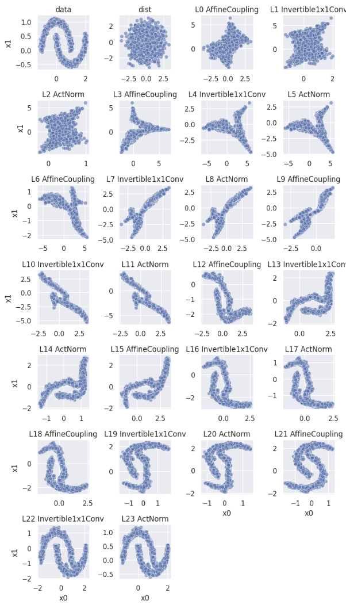

In this pratical session, I implemented normalizing flow models. To be more specific:

- In the `utils.py` file, I implemented:
  - a naive model with only one layer, where the decoder is an affine transformation defined as $\mathbf{x} = f(\mathbf{z}; \mathbf{s}, \mathbf{t}) = \mathbf{z} \odot \exp(\mathbf{s}) + \mathbf{t}$. The model is then trained on a dataset containing samples drawn from the distribution $\mathcal{N}(-1, 1.5)$. The prior distribution is chosen to be $\mathcal{N}(0, 1)$.
  - the [Glow model](https://arxiv.org/abs/1807.03039) and trained it on Scikit-learn's [moon](https://scikit-learn.org/stable/modules/generated/sklearn.datasets.make_moons.html) dataset. The prior distribution is chosen to be a multivariate Gaussian $\mathcal{N}(0, I_2)$, where $I_2$ is the $2 \times 2$ identity matrix.

- The `plot.ipynb` file shows the scatter plots of samples drawn from the prior distribution $\mathcal{N}(0, I_2)$ and how the samples are transformed after each layer of the Glow model, as shown in the figure below: 
